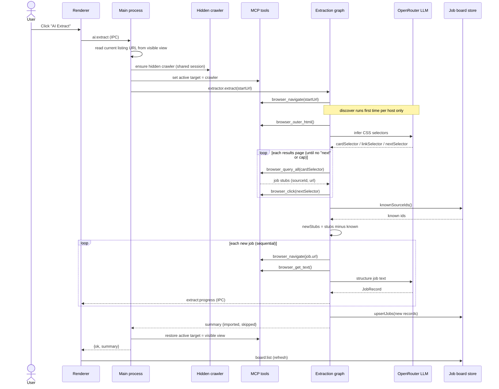

# Architecture — Job Search Co-pilot

## Overview

The Job Co-pilot is an Electron desktop application that helps a job seeker turn a
filtered search on any job site into a curated, de-duplicated job board inside the app.
The user logs in and applies filters in an embedded browser; a single **AI Extract**
action then crawls the full result set, imports each posting in detail, and on every
subsequent run brings in only postings that haven't been seen before. Jobs can be opened
back in the embedded browser or flagged as not interested, and dismissed jobs never
return.

The system is built on a deliberately layered stack: Electron provides the desktop shell
and an embedded Chromium browser; a Model Context Protocol (MCP) server hosted inside the
app exposes browser-driving tools; a LangGraph state machine orchestrates the crawl;
LangChain supplies the model and tool abstractions; and OpenRouter is the model-agnostic
LLM gateway. Job data persists locally.

## Goals and non-goals

The product goal is reliable, low-friction extraction of *every* job in a filtered
listing, with cheap incremental re-imports and durable user triage. Reliability and cost
are first-order concerns, which is why the crawl is deterministic and the language model
is confined to two narrow, well-bounded tasks.

It is explicitly **not** a credential manager, an anti-bot circumvention tool, or a
general autonomous web agent. The user authenticates themselves; the app never sees or
stores credentials, and it does not attempt to defeat CAPTCHAs or bot checks. It is also
not a hosted/multi-user service — state is local to the user's machine.

## Technology stack

- **Electron (≥ 30)** — desktop shell; `WebContentsView` for the embedded browser; ESM main process.
- **Model Context Protocol (TypeScript SDK)** — in-process server exposing browser tools over Streamable HTTP, bound to `127.0.0.1`.
- **LangGraph (`@langchain/langgraph`)** — stateful graph runtime that orchestrates the crawl.
- **LangChain (`@langchain/openai`, `@langchain/mcp-adapters`, `@langchain/core`)** — chat-model wrapper and the adapter that turns MCP tools into LangChain tools.
- **OpenRouter** — OpenAI-compatible Chat Completions gateway; the LLM provider, swappable per model slug.
- **Local JSON store** — the internal job board and cached per-site layout profiles, in Electron's `userData` directory.

## High-level architecture

```mermaid
flowchart LR
  user([Job seeker])
  site[Job site]
  or["OpenRouter<br/>LLM gateway"]

  subgraph app[Electron application]
    ui["Renderer panel<br/>board.html"]
    main["Main process<br/>main.ts + app-integration.ts"]
    visible["Visible embedded browser<br/>WebContentsView"]
    crawler["Hidden crawler<br/>BrowserWindow (show:false)"]
    mcp["MCP server<br/>browser + extraction tools<br/>(127.0.0.1, Streamable HTTP)"]
    graph["Extraction graph<br/>LangGraph"]
    store[("Job board store<br/>JSON in userData")]
  end

  user -->|log in + filter| visible
  user -->|AI Extract / triage| ui
  ui <-->|IPC bridge| main
  main --> mcp
  main --> graph
  graph -->|tools over localhost| mcp
  mcp -->|drive active target| visible
  mcp -->|drive active target| crawler
  visible <--> site
  crawler <--> site
  graph -->|structured output| or
  graph --> store
  main --> store
```

The defining structural choice is the **MCP boundary**: every browser capability
(navigate, read text, click, type, query elements, scroll, screenshot) is a tool on an
in-process MCP server rather than a direct call into Electron. This keeps browser control
decoupled and reusable, lets the same tools serve both an interactive co-pilot and the
batch extractor, and would allow the agent to run out-of-process unchanged. The tools
operate on whatever **active target** the main process points them at — normally the
visible view, but the hidden crawler during extraction.

## Components

**Renderer (`board.html`)** is the left-hand UI panel: the AI Extract button, a live
progress line, and the job board list with per-job Open and Not-interested actions. It
holds no business logic and reaches the main process only through a small preload bridge
(`preload.cjs`, kept as CommonJS to avoid ESM-preload pitfalls).

**Main process (`main.ts`)** owns the window and its two browsers — the visible
`WebContentsView` and a lazily created hidden `BrowserWindow` crawler — plus the
active-target seam that decides which `webContents` the MCP tools drive. It starts the MCP
server and registers the application IPC.

**MCP server (`mcp-browser-server.ts`, `extraction-tools.ts`)** is a Streamable HTTP
server, session-per-connection, bound to localhost. The base tools cover interactive
browsing; the extraction tools (`browser_query_all`, `browser_outer_html`,
`browser_scroll`) exist specifically so the crawl can enumerate and discover layout
deterministically.

**Extraction graph (`extraction-graph.ts`)** is the brain — a LangGraph `StateGraph` whose
nodes are deterministic code that calls MCP tools, with the LLM invoked only inside two
nodes. Its flow is `init → discover → enumerate → (paginate loop) → dedup → extractDetails
→ persist`.

**Job board store (`job-board-store.ts`)** is the local persistence layer: a JSON file
keyed by a stable `sourceId`, with insert-if-absent semantics, status flagging, and a
cache of discovered per-site layout profiles.

**App integration (`app-integration.ts`)** is the glue: it builds the MCP client, the
OpenRouter-backed model, and the extractor; handles the `ai:extract`, `board:list`,
`board:setStatus`, and `view:open` IPC calls; and manages the hidden crawler and the
retargeting of MCP tools during a run.

## Key design decisions

**The crawl is deterministic; the LLM does two narrow jobs.** Making a model responsible
for "loop over every job across every page" is where extraction loses items and
hallucinates. Enumeration, pagination, and de-duplication are therefore plain code. The
model is used only to (1) discover the page's CSS selectors and (2) structure each new
job's detail text into a typed record. This bounds both error and cost, and keeps the
system general across sites.

**Layout discovery is cached per host (or hand-authored).** The first time the app sees a
hostname, it asks the model for the job-card, link, and next-page selectors and stores
that profile. Subsequent runs are fully deterministic. For sites used repeatedly, a
profile can be authored by hand to skip the one inferential step entirely — the most
robust option.

**De-duplication happens at the listing level, before any detail fetch.** Each card
exposes a job link, so the graph derives a stable `sourceId` from the URL while still on
the listing, diffs against the board, and only opens detail pages for genuinely new jobs.
This is what makes re-runs nearly free and is the mechanism behind incremental import.

**Extraction runs in a hidden window that shares the session.** Crawling in the visible
view would hijack the page the user is on. Instead the app reads the current listing URL
(filters live in the query string, so they reproduce), then crawls in a hidden
`BrowserWindow` on the same default session — so the user's login carries over — while
their view stays put.

**OpenRouter via LangChain, orchestrated by LangGraph.** OpenRouter is reached through a
plain `ChatOpenAI` pointed at its base URL, which is why the LangChain layer fits cleanly
with a model-agnostic gateway. LangGraph was chosen over a bare agent because the co-pilot
is stateful and interruptible by nature, and the graph gives a clear path to checkpointing
and human-in-the-loop gating.

**Detail extraction is sequential.** There is a single crawler view, so new jobs are
opened and structured one at a time. This is a real constraint, not an oversight; a pool
of hidden crawler windows is the scale-up.

## The extraction flow



## Data model

```ts
type JobStatus = 'new' | 'seen' | 'not_interested';

interface JobRecord {
  sourceId: string;      // stable id, e.g. "www.linkedin.com:3891234567"
  url: string;           // detail page
  title: string;
  company: string;
  location?: string;
  workplaceType?: string;
  employmentType?: string;
  salary?: string;
  postedDate?: string;
  description?: string;  // full plain-text
  applyUrl?: string;
  status: JobStatus;
  importedAt: string;    // ISO
}

interface SiteProfile {
  hostname: string;
  cardSelector: string;  // each job card in the listing
  linkSelector?: string; // anchor inside a card → detail URL
  nextSelector?: string; // next-page control (omit for infinite scroll / none)
  idFromUrl?: string;    // optional regex (capture group) for the job id
}
```

The store file is `{ jobs: Record<sourceId, JobRecord>, sites: Record<hostname, SiteProfile> }`.

## Incremental import and de-duplication

Identity is derived from the posting URL. `deriveSourceId` recognises the common job-site
patterns — `currentJobId` (LinkedIn), `jk` (Indeed), `gh_jid` (Greenhouse), generic `id`
keys — and falls back to a long numeric path segment, then to the path itself. Because the
`sourceId` is computed from the listing, the diff against the board happens before any
detail page is opened.

The board stores every `sourceId` it has ever seen, including jobs flagged not interested.
On a re-run, the dedup step removes all known ids from the enumerated set, so previously
imported jobs are not duplicated and dismissed jobs are never re-imported. The user's
triage is therefore durable across extractions, and the cost of a re-run scales with the
number of *new* postings, not the size of the listing.

## Security, privacy, and responsible use

Credentials are out of scope by design: the user logs in themselves in the embedded
browser, and the application neither captures, stores, nor enters credentials. The MCP
server binds to `127.0.0.1` so it is not reachable off the machine, with DNS-rebinding
protection available as a hardening step. All job data and site profiles stay on the local
disk.

Page content is treated as untrusted input. The extractor is read-mostly and deterministic,
which limits the surface for prompt-injection from a malicious posting; the general-purpose
`browser_eval` tool is flagged as trusted-pages-only. The crawl throttles its requests, and
when a site presents a CAPTCHA or bot challenge the system stops rather than attempting to
bypass it.

## Constraints and operational notes

The build is ESM and targets Electron ≥ 30 for `WebContentsView` and ESM-main support; the
preload is CommonJS for compatibility. The MCP transport is Streamable HTTP with one
session per client connection. Structured extraction requires a tool/function-calling
capable model on OpenRouter (Claude 3.5+, GPT-4o-class, Gemini), since structured output is
implemented via function calling. Pagination currently clicks a discovered "next" control
and waits a fixed interval, which suits classic paged results but needs per-site handling
for infinite scroll or virtualized lists. Persistence is a JSON file, adequate for this
scale; SQLite is the drop-in upgrade behind the same store interface.

## Extension points and roadmap

The clearest next step is making extraction resumable by attaching a LangGraph checkpointer,
which also enables interrupt-based human-in-the-loop gating — pausing the run for approval
or letting not-interested flagging take effect mid-crawl. Beyond that: a pool of hidden
crawler windows to parallelize detail extraction, pluggable pagination strategies
(infinite-scroll and wait-for-selector), hand-authored site profiles for high-traffic
sites, and richer board features (search, tags, application tracking) on top of the
existing store.

## Repository layout

```
src/
  main.ts                 Electron main: window, embedded browser, hidden crawler, target seam, wiring
  mcp-browser-server.ts   MCP server + Streamable HTTP transport; base browser tools
  extraction-tools.ts     Extraction MCP tools: query_all, outer_html, scroll
  extraction-graph.ts     LangGraph StateGraph: the crawl + dedup + structuring (the brain)
  job-board-store.ts      Local JSON store: jobs (dedup, status) + cached site profiles
  app-integration.ts      IPC handlers, MCP client + OpenRouter model, hidden-crawler management
  preload.cjs             contextBridge IPC surface for the renderer
  renderer/board.html     The job board UI panel
  run-agent.ts            Standalone OpenAI Agents SDK client (reference)
  run-agent-langchain.ts  Standalone LangChain client (reference)
```
